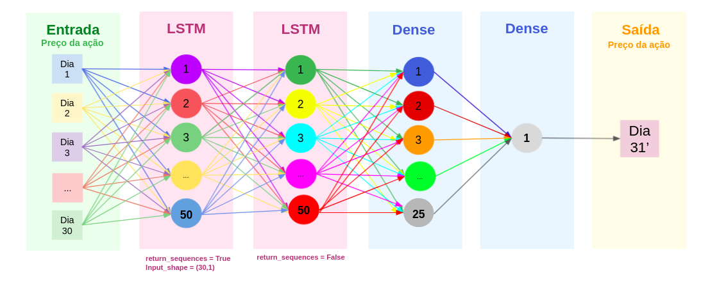
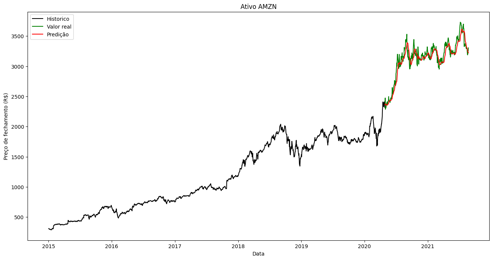

# **LSTM - Previsão de preços de ações**

## Links que comentei nas reuniões

- [Link para o vídeo do mini curso de ML](https://seniorsistemassa-my.sharepoint.com/:v:/g/personal/paula_campigotto_senior_com_br/EWLEPtH5scpHmpk8tZ-2S2sBtIPupqu0BC8aNSTTohhuxw?e=r1wWIU)
- - [Artigos do CBIC sobre mercado financeiro](https://sbic.org.br/eventos/cbic_2021/#st04)
- - [Recomendação de curso sobre ML](https://www.coursera.org/learn/machine-learning/)
- - [Recomendação de livro sobre ML](https://www.amazon.com.br/M%C3%A3os-Obra-Aprendizado-Scikit-Learn-Inteligentes/dp/8550815489/ref=asc_df_8550815489/?tag=googleshopp00-20&linkCode=df0&hvadid=379715964603&hvpos=&hvnetw=g&hvrand=17329341288120638174&hvpone=&hvptwo=&hvqmt=&hvdev=c&hvdvcmdl=&hvlocint=&hvlocphy=9102333&hvtargid=pla-1390910077420&psc=1)

- [Link para o vídeo da apresentação da AWS](https://seniorsistemassa-my.sharepoint.com/:v:/g/personal/paula_campigotto_senior_com_br/EWLEPtH5scpHmpk8tZ-2S2sBtIPupqu0BC8aNSTTohhuxw?e=r1wWIU)



## **Configurações da biblioteca pandas_datareader**

```
! pip install --upgrade numpy
! pip install --upgrade pandas
! pip install --upgrade pandas-datareader
```

## **Obtenção dos dados**

```py
import pandas_datareader as dados
import pandas as pd

ativo = "AMZN"  # https://finance.yahoo.com/

dados_do_ativo = dados.DataReader(ativo, start="2015-01-01",end="2021-08-24", data_source='yahoo')
```

## **Visualização dos dados**

```py
import matplotlib.pyplot as plt
# plt.style.use('fivethirtyeight')
# plt.style.use('default')

plt.figure(figsize=(16,8))
plt.title('Histórico de fechamento ' + ativo)
plt.plot(dados_do_ativo['Close'])
plt.xlabel('Data')
plt.ylabel('Preço de fechamento')
plt.show()
```

### **Preparação dos dados**

```py
cotacoes_df = dados_do_ativo.filter(['Close'])
cotacoes = cotacoes_df.values

from sklearn.preprocessing import MinMaxScaler

normalizador = MinMaxScaler(feature_range=(0, 1)) 
cotacoes_normalizadas = normalizador.fit_transform(cotacoes)
```

## **Separação dos dados para treinamento**
```py
from math import ceil

dias_treinamento = ceil( len(cotacoes) *.8) 
cotacoes_treinamento = cotacoes_normalizadas[0:dias_treinamento]

x_treino=[]
y_treino = []

for i in range(30,len(cotacoes_treinamento)):
    x_treino.append(cotacoes_treinamento[i-30:i])
    y_treino.append(cotacoes_treinamento[i])


import numpy as np

x_treino, y_treino = np.array(x_treino), np.array(y_treino)

x_treino = np.reshape(x_treino, (len(x_treino),30,1))

```
## **Criação do modelo**

```py
from keras.models import Sequential
from keras.layers import Dense, LSTM

model = Sequential()

model.add(LSTM(units=50, return_sequences=True,input_shape=(30,1)))
model.add(LSTM(units=50, return_sequences=False))

model.add(Dense(units=25))
model.add(Dense(units=1))

model.compile(optimizer='adam', loss='mean_squared_error')
```

## **Treinamento do modelo**
```py
model.fit(x_treino, y_treino, batch_size=1, epochs=1)
```

## **Separação e preparação dos dados para o teste**
```py
cotacoes_teste = cotacoes_normalizadas[dias_treinamento - 30:]

x_teste = []
y_teste =  cotacoes[dias_treinamento:] 
for i in range(30,len(cotacoes_teste)):
    x_teste.append(cotacoes_teste[i-30:i])


x_teste = np.array(x_teste)
x_teste = np.reshape(x_teste, (len(x_teste),30,1))
```

## **Teste (predição)**

```py
predictions = model.predict(x_teste) 

predictions = normalizador.inverse_transform(predictions)
```

## **Cálculo do erro (diferença entre predição e valor real)**
```py
rmse=np.sqrt(np.mean(((predictions- y_teste)**2)))
rmse
```
## **Gráfico de comparação**

```py
treino = cotacoes_df[:dias_treinamento]
valido = cotacoes_df[dias_treinamento:]
valido['Predictions'] = predictions
plt.figure(figsize=(16,8))
plt.title('Ativo ' + ativo)
plt.xlabel('Data')
plt.ylabel('Preço de fechamento (R$)')
plt.plot(treino['Close'], color = 'black')
plt.plot(valido['Close'], color = 'green')
plt.plot(valido['Predictions'], color = 'red')
plt.legend(['Historico', 'Valor real', 'Predição'])
plt.show()
```
## **Teste atual**
```py
dados_do_ativo = dados.DataReader(ativo, start="2021-08-23",end="2021-10-05", data_source='yahoo')

x = dados_do_ativo.filter(['Close'])
x = normalizador.fit_transform(x)
x = np.array(x)[:-1] # remover o dia 05/10
x = np.reshape(x, (1,30,1))

prediction = model.predict(x) 

prediction = normalizador.inverse_transform(prediction)
real = dados_do_ativo.filter(['Close']).values[-1]

print('pedição: ',prediction)
print('real: ',real)
```


